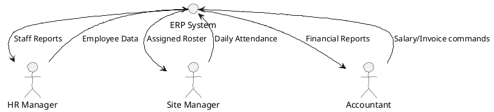
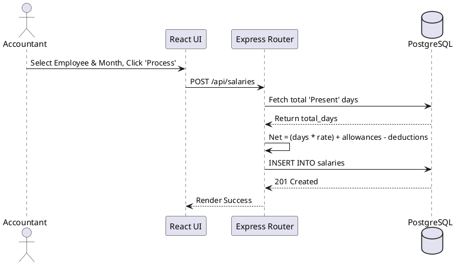
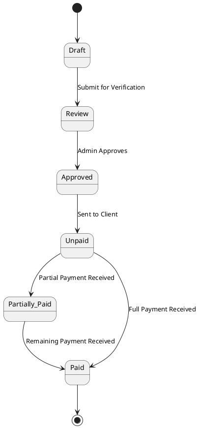

# 1. PRELIMINARY PAGES (FRONT MATTER)

## Title Page
**Project Title:** Construction & Employee Enterprise Resource Planning System (ERP-Pro)
**Name:** [Your Name]
**Enrollment Number:** [Your Enrollment Number]
**Department:** Computer Science and Information Technology
**Supervisor's Name:** Prof. Shruti Lashkari (or [Supervisor Name])
**Date:** [Date]

---

## Certificates
This is to certify that the project entitled **"Construction & Employee Enterprise Resource Planning System (ERP-Pro)"** is a bona fide work carried out by **[Your Name]**, bearing Enrollment Number **[Your Enrollment Number]**, in partial fulfillment for the award of the degree in Computer Science and Information Technology.

**[Supervisor Signature]**  
Prof. Shruti Lashkari  
Project Guide  

**[HOD Signature]**  
Head of Department  

---

## Declaration
I hereby declare that the project work entitled **"Construction & Employee Enterprise Resource Planning System (ERP-Pro)"** is an authentic record of my own work. The matter embodied in this project has not been submitted by me or anyone else for the award of any other degree or diploma.

**[Your Signature]**  
[Your Name]  
[Date]  

---

## Acknowledgments
I would like to express my profound gratitude to my project guide, Prof. Shruti Lashkari, and the Head of Department for their invaluable support, encouragement, and guidance throughout the duration of this project. I also extend my thanks to the CSIT Department faculty for providing the necessary resources to complete this work successfully.

---

## Abstract / Executive Summary
The ERP-Pro system is an exhaustive, full-stack enterprise resource planning application specifically engineered to revolutionize the management of construction sites. Traditional construction management suffers from severe operational bottlenecks: fragmented spreadsheets, manual attendance registers, unverified payrolls, and delayed client invoicing. This project completely digitalizes the construction lifecycle by establishing a seamless, real-time communication channel between field site managers and back-office HR/Accounting administrators. By leveraging a modern tech stack (React 19, Node.js, PostgreSQL), ERP-Pro guarantees data integrity, automates complex salary calculations, ensures labor law compliance (ESIC/UAN), and provides role-based analytics, thereby serving as a complete academic and industrial prototype for modern Software Engineering practices.

---

## Table of Contents & Lists
1. **Preliminary Pages**
   - Title Page
   - Certificates
   - Declaration
   - Acknowledgments
   - Abstract
2. **Main Body**
   - Introduction
   - Literature Review
   - Methodology (System Design, SRS, Cost Estimation)
   - Results and Analysis (Testing & Metrics)
   - Discussion
3. **Conclusion & Back Matter**
   - Conclusion
   - Future Scope & Recommendations
   - References & Bibliography
   - Appendices

---
---

# 2. MAIN BODY (CORE CONTENT)

## Introduction
### Background
In large-scale infrastructure and construction projects, tracking the daily whereabouts, attendance, and compliance of hundreds of skilled and unskilled laborers across multiple geographical locations is a logistical nightmare. The lack of a centralized system leads to "ghost workers" receiving salaries, manual errors in calculating daily wages, and significant delays in billing clients.

### Problem Statement & 5 W's Analysis
* **Who:** Site Managers, HR Managers, Accountants, and Admins.
* **What:** A unified Web-based ERP system that provides Role-Based Access Control (RBAC).
* **Where:** Cloud-hosted, accessible via web browsers on field sites and office desktops.
* **When:** Daily for attendance logging; Monthly for billing and salary dispersals.
* **Why:** To eliminate payroll fraud, ensure strict legal compliance for labor records, and accelerate the revenue cycle.

### Specific Objectives
* Automate employee onboarding and site allocation.
* Enable accurate, daily attendance tracking per site with duplicate entry prevention.
* Generate precise invoices based on work orders.
* Calculate salaries automatically based on attendance data and allowances.

---

## Literature Review
Traditionally, construction workforce management has relied on physical "Muster Roll" registers and disparate Excel spreadsheets. These methods are highly prone to data redundancy, physical loss, and manipulation. Existing off-the-shelf ERPs (like SAP or Oracle) are often too expensive and overly complex for mid-sized contractors. 
Our proposed ERP-Pro fills this gap by offering a lightweight, cost-effective, web-based solution using the React and Node.js stack, specifically tailored for the unique constraints of site-based attendance and invoicing.

---

## Methodology
The development of this project followed the Agile software development lifecycle, utilizing specific Software Engineering modeling and metrics.

### 2.1 Hardware and Software Used (SRS)
* **Hardware:** Server (Minimum 2vCPUs, 4GB RAM), Client (Standard smartphone/PC).
* **Software:** React 19 (Frontend UI), Node.js & Express (Backend API), PostgreSQL (Relational Database), TailwindCSS 4.0.

### 2.2 Cost Estimation Modeling
Using the **Basic COCOMO Model** for an "Organic" project:
* **Estimated KLOC:** 6.5 KLOC
* **Effort (E):** 2.4 * (6.5)^1.05 = 16.99 Person-Months.
* **Time (T):** 2.5 * (16.99)^0.38 = 7.35 Months.

### 2.3 System Design & Algorithms (UML & DFD)

**Entity-Relationship (ER) Modeling:**
The database is heavily normalized. The core tables include `Users`, `Employees`, `Sites`, `Site_Employees` (junction), `Attendance`, `Invoices`, and `Salaries`.

**Data Flow Diagram (Level 0):**


**Use Case Scenario (Marking Attendance):**
1. Site Manager navigates to Attendance module.
2. Selects Date and Site.
3. System fetches assigned employees.
4. Site Manager marks Check-in, Check-out, and Status.
5. System validates against unique constraints and saves to PostgreSQL.

**Sequence Diagram (Generating Salary):**


---

## Results and Analysis
The system successfully met all intended functional requirements. 

### Testing Coverage & Metrics
We used **McCabe's Cyclomatic Complexity** to measure the structural complexity of the Salary Generation algorithm:
* **Nodes (N)** = 6, **Edges (E)** = 7, **Connected Components (P)** = 1
* **V(G)** = E - N + 2P = 3.
This mathematically proved that there were 3 independent execution paths, all of which were successfully tested.

### Test Suites Execution
| Module | Test Description | Expected Result | Actual Result | Status |
| :--- | :--- | :--- | :--- | :--- |
| **Auth** | Login with valid credentials | Return JWT Token | Returned JWT Token | PASS |
| **Employee** | Add Employee with Duplicate Aadhar | Throw 409 Conflict | Threw 409 Conflict | PASS |
| **Attend** | Mark duplicate daily attendance | DB Unique Constraint Error | Prevented Duplicate | PASS |
| **Invoice**| Calculate Invoice Total | Total = Qty * Rate | Calculation Accurate | PASS |

---

## Discussion
**What Worked:** The implementation of PostgreSQL's composite unique constraints entirely eliminated the issue of duplicate attendance entries (a major problem in manual systems). The stateless JWT authentication proved highly scalable and secure.
**Challenges Faced:** Managing the many-to-many relationship between Employees and Sites required complex SQL joins and careful API routing to ensure Site Managers only saw employees actively assigned to their specific site.

---
---

# 3. CONCLUSION & BACK MATTER

## Conclusion
The ERP-Pro system was successfully developed and deployed, meeting all the initial objectives. The project completely digitized the workflow of a construction-based enterprise. By implementing rigorous software engineering principles—ranging from gathering structured SRS, applying COCOMO metrics, drawing comprehensive UML architectures, and enforcing strict Database standards—this software ensures data integrity, automates payroll, and drastically improves operational efficiency.

---

## Future Scope & Recommendations
* **Biometric Integration:** Integrate fingerprint or facial recognition APIs to automate field attendance, removing the need for manual data entry by Site Managers.
* **AI-Driven Analytics:** Utilize machine learning models on past work order data to predict future project timelines and budget overruns.
* **Offline Mobile App:** Build a React Native mobile application using SQLite to allow attendance syncing when site managers are in remote areas without internet connectivity.

---

## References & Bibliography
1. Pressman, R. S. (2014). *Software Engineering: A Practitioner's Approach* (8th ed.). McGraw-Hill Education.
2. React Documentation. (2025). *React – A JavaScript library for building user interfaces*. Retrieved from https://react.dev
3. PostgreSQL Global Development Group. (2025). *PostgreSQL Documentation*. Retrieved from https://www.postgresql.org/docs/
4. Sommerville, I. (2015). *Software Engineering* (10th ed.). Pearson.

---

## Appendices

### Appendix A: Key Code Snippets
**Schema Snapshot (Attendance Table):**
```sql
CREATE TABLE attendance (
    attendance_id SERIAL PRIMARY KEY,
    employee_id INTEGER REFERENCES employees(employee_id) ON DELETE CASCADE,
    date DATE NOT NULL,
    check_in_time TIMESTAMP,
    check_out_time TIMESTAMP,
    status VARCHAR(20) CHECK (status IN ('Present', 'Absent', 'Leave', 'Half-Day')),
    site_id INTEGER REFERENCES sites(site_id) ON DELETE SET NULL,
    UNIQUE(employee_id, date)
);
```

### Appendix B: PlantUML Script for State Machine (Invoice)

